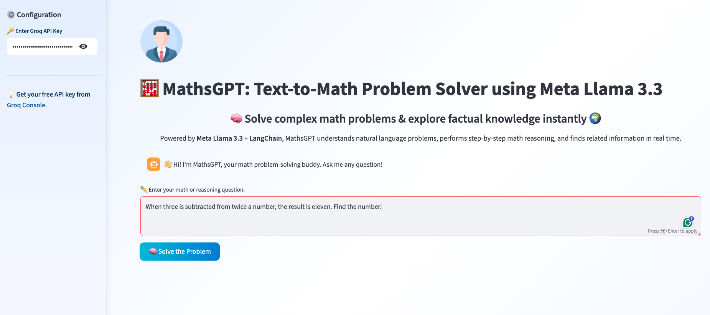

# 🧮 MathsGPT: Text-to-Math Problem Solver using Meta Llama 3.3
MathsGPT bridges natural language and numerical logic — a Groq-driven AI that thinks, reasons, and solves like a human mathematician. It is an AI-powered reasoning engine that transforms plain text questions into step-by-step mathematical solutions using Meta Llama 3.3 + LangChain intelligence.

A LangChain + Groq-powered interactive **Math and Knowledge Assistant** capable of solving step-by-step math problems 🧠 and performing factual lookups 🌍 through Wikipedia.

---

## 🖼️ Application Preview

#### Home Screen
 

#### Summary Output
 


---


## 🚀 Features

- 🧮 Step-by-step math reasoning powered by **LLMMathChain**
- 🔢 Logical and word problem solving using **Meta Llama 3.3 (70B)** via Groq
- 🌍 Real-time Wikipedia integration for factual lookups
- 💬 Interactive chat interface with **Streamlit**
- 🎨 Light pastel UI with responsive styling

---

## 🧩 Tech Stack

| Component | Technology |
|------------|-------------|
| Frontend/UI | Streamlit |
| Backend | Python |
| LLM Model | Meta Llama 3.3 (70B) via Groq |
| Framework | LangChain |
| Tools | LLMMathChain, WikipediaAPIWrapper, Reasoning Agent |

---

## ⚙️ Installation
```bash
git clone https://github.com/pahul1712/MathsGPT-Text-to-Math-Problem-Solver.git
cd MathsGPT-Text-to-Math-Problem-Solver
pip install -r requirements.txt
streamlit run app.py
```

---


## 🧠 Example Query

Question:
I have 5 bananas and 7 grapes. I eat 2 bananas and give away 3 grapes. Then I buy a dozen apples and 2 packs of blueberries (25 berries each). How many fruits do I have in total?

Answer:
67 total fruits 🍌🍎🫐


---

## 💡 Future Enhancements

- ✏️ Add LaTeX-rendered math expressions
- 🔊 Integrate text-to-speech for answers
- 📈 Show step-by-step calculation visualization
- 💾 Add chat history export feature


---


## 🧑‍💻 Author

Pahuldeep Singh Dhingra
- 🧑‍🏫 Graduate Teaching Assistant 
- 🎓 M.S. Data Science & Analytics @ FAU
